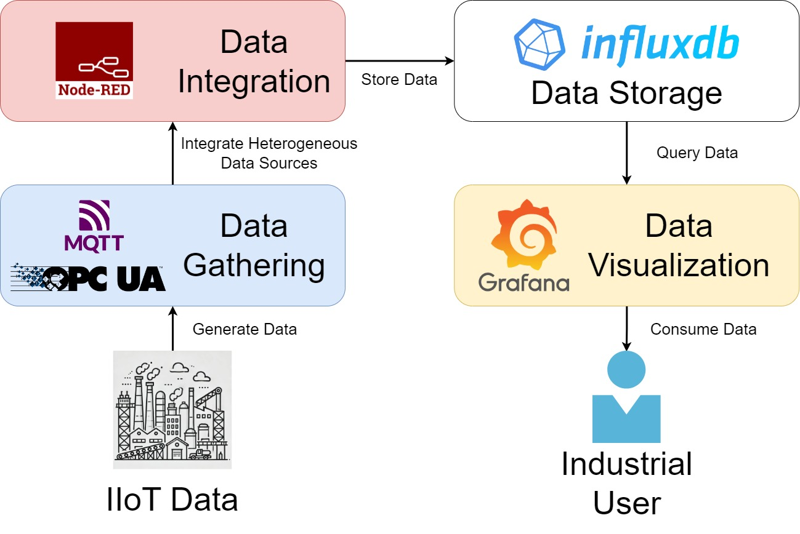

# MING Stack Tutorial

This repo was created for a tutorial on [XIV Symposition on Computing Systems Engineering](https://sbesc.lisha.ufsc.br/sbesc2024/Home) held on November 26-29, 2024 in Recife - PE - Brazil, called "How to generate value in industry with IoT data with a simple service stack?".

## Tutorial Abstract

This tutorial will present the concepts and practices needed to add value in the industry using a simple and open-source service stack. The goal is to provide a clear understanding of the application of the Industrial Internet of Things (IIoT) and Edge Computing in data-driven decision-making. Using tools such as Node-RED, InfluxDB, Grafana, and the MQTT protocol, we will demonstrate how to efficiently collect, integrate, and visualize real-time data in a cost-effective manner. Additionally, a real case study will be presented, highlighting the implementation of these technologies at Labfaber of CERTI Foundation. This tutorial is aimed at undergraduate and graduate students, as well as technology professionals interested in exploring the possibilities of IIoT to optimize industrial processes and increase operational efficiency.

## Authors

Arthur Raulino Kretzer - <https://github.com/ArthurKretzer> - IIoT | Data Engineer | Mechatronics

João Victor Melquiades Sátiro - IIoT | Mechatronics

## Project Description

The MING stack is a powerful combination of tools designed for monitoring and analyzing industrial or IoT systems. This stack integrates the following components:

1. **MQTT (Eclipse Mosquitto)**: A lightweight message broker suitable for IoT communication.

2. **InfluxDB**: A time-series database optimized for storing metrics and events.

3. **Node-RED**: A flow-based development tool for wiring together hardware devices, APIs, and online services.

4. **Grafana**: A visualization platform for displaying metrics and logs from a variety of data sources.


This project provides a pre-configured Docker Compose setup for deploying the MING stack with pre-installed Node-RED nodes for OPC-UA and InfluxDB integration.



## Features

* MQTT broker for real-time communication.

* InfluxDB for efficient time-series data storage.

* Node-RED with pre-installed palettes for easy development of automation workflows.

* Grafana for creating real-time dashboards and monitoring.

## Installation Tutorial

### Prerequisites

1. **Docker**: Ensure Docker is installed on your system.

    * [Install Docker](https://docs.docker.com/engine/install/)

2. **Docker Compose**: Ensure Docker Compose is installed.

    * [Install Docker Compose](https://docs.docker.com/compose/install/)

### Steps

1. **Clone the Repository**

    ```bash
    git clone https://github.com/ArthurKretzer/tutorial-ming-stack
    cd tutorial-ming-stack
    ```

2. **Set Up Environment Variables**

    Create a .env file in the project directory and add the following:

    ```text
    GF_SECURITY_ADMIN_USER=admin
    GF_SECURITY_ADMIN_PASSWORD=admin_password
    ```

3. **Run the Stack**

    Start all services using Docker Compose:

    ```bash
    docker-compose up -d
    ```

4. **Verify Services**

    * **MQTT**: Available at tcp://localhost:1883 (MQTT) and <http://localhost:9001> (WebSocket).

    * **InfluxDB**: Accessible at <http://localhost:8086>.

    * **Node-RED**: Accessible at <http://localhost:1880>.

    * **Grafana**: Accessible at <http://localhost:3000>.

5. **Log in to Grafana**

    * Username: admin (or as set in .env)

    * Password: admin_password (or as set in .env)

## Pre-installed Node-RED Palettes

The following Node-RED palettes are pre-installed:

1. **node-red-contrib-opcua**: For OPC-UA server and client functionality.

2. **node-red-contrib-influxdb**: For integration with InfluxDB.

To use these nodes, simply create flows in Node-RED and wire the nodes to your desired endpoints.

## Stopping the Stack

To stop the stack:

```bash
docker-compose down
```

This will stop and remove all containers but retain data in the volumes.

## Additional Configuration

### Changing Ports

If default ports conflict with existing services, modify the ports section in the docker-compose.yml file.

### Updating Node-RED Palettes

To specify versions for pre-installed palettes, update the command in the node-red service:

```bash
command: >
  /bin/bash -c "
    npm install node-red-contrib-opcua@<version> node-red-contrib-influxdb@<version> &&
    npm start
  "
```

Replace <version\> with the desired version.

### Support

For any issues or questions, please raise an issue in the repository or contact the maintainers.
